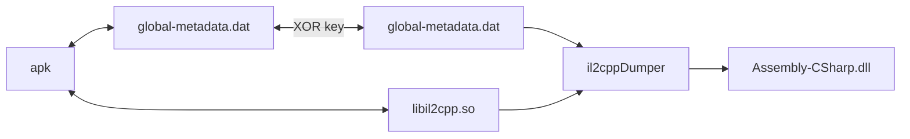

# Project SEKAI 逆向笔记 持续更新

非常喜欢 Project Sekai 这款游戏，不过我本身是主要学习密码学的，对逆向不甚了解，仅向下面博客进行了拙劣的学习，尝试提供一些基础的实践尝试，可能会记录得过于详细。

↓↓↓↓↓↓↓↓↓↓↓↓↓↓↓↓

pjsk逆向唯一神贴: [Project SEKAI 逆向 - 笔记归档](https://mos9527.com/posts/pjsk/archive-20240105/)

↑↑↑↑↑↑↑↑↑↑↑↑↑↑↑↑

## 更新日志

- `20250410` 完成了 `静态解包` `第三方工具` 等部分的大致整理
- `20250411` 完成了 `提取 global-metadata.dat` 部分的整理
- 忘了
- `20260331` 完成了 `修改 API-url`

## 静态解包

参见：[【世界计划 多彩舞台】PJSK游戏资源解包教程-补充资料：新版](https://www.bilibili.com/opus/579098944556614370)

## 动态分析

### `cn-3.4.0` 提取 `global-metadata.dat` (成功)

参考 [Project SEKAI 逆向 - 笔记归档](https://mos9527.com/posts/pjsk/archive-20240105/)

研究版本：Project Sekai 国服 3.4.0

#### 游戏安装包(失败)

拿到公测开始公布的安装包，解压，找到`./assets/bin/Data/Managed/Metadata/global-metadata.dat`

发现 `AF 1B B1 FA`，但是在第九个字节开始，真的没加密吗？*~~我不信会这么仁慈~~*


尝试把前八个字节删掉，并找到 `./lib/arm64-v8a/libil2cpp.so`，一并丢给 [Il2CppDumper](https://github.com/Perfare/Il2CppDumper/)

果不其然报错了，而且是运行一半之后才报错，如图


查看 `hexdump` 发现整个文件到处都是乱码，应该还是有加密

#### `/proc/[PID]/maps` 提取 `libcamera-metadata.dat` (失败)

参照 [metadata 动态提取](https://mos9527.com/posts/pjsk/archive-20240105/#1-metadata-%E5%8A%A8%E6%80%81%E6%8F%90%E5%8F%96) 中的方法

启动游戏，进 `adb shell` 用 `top` 命令拿 `PID=31607`


`su` 后在 `/proc/[PID]/maps` 查找 `metadata`，结果如图


使用 `dd` 来 `dump` 这三段内存

```shell
dd if=/proc/31607/mem of=/sdcard/libcamera_metadata.so.1 bs=1 skip=$(printf "%u" 0x715074d000) count=$((0x7150755000-0x715074d000))
dd if=/proc/31607/mem of=/sdcard/libcamera_metadata.so.2 bs=1 skip=$(printf "%u" 0x715076a000) count=$((0x715076b000-0x715076a000))
dd if=/proc/31607/mem of=/sdcard/libcamera_metadata.so.3 bs=1 skip=$(printf "%u" 0x715076b000) count=$((0x715076d000-0x715076b000))
```

第一个是 `ELF`，第二个第三个不知道是什么东西


#### 内存搜索 `AF 1B B1 FA` (失败)

分别使用 Frida 和 GameGuardian 使用众多方法在内存中搜索魔术头 `AF 1B B1 FA` 无果。

注意：使用 GameGuardian 有封号风险，谨慎使用


痛失小号×1

~~*其实还可能是因为出于恶搞，用 GG 在游戏里面改了 2147483647 个水晶（当然只是前端）*~~


当时 root 机截图坏了，临时拍了个屏

#### 内存搜索特殊字段(成功)

虽然被 ban 了，但是毕竟游戏的 metadata 已经被加载了，尝试继续在游戏开始界面

还是在 [metadata 动态提取](https://mos9527.com/posts/pjsk/archive-20240105/#1-metadata-%E5%8A%A8%E6%80%81%E6%8F%90%E5%8F%96) 中，发现其他服中的 metadata 有这样的字符串


GG 搜了一下 `mscorlib`，有好多结果，又搜了一下 `mscorlib.dll.<Module>`(注意用十六进制搜，里面有的点并不是字符点)，我草，唯一结果


所在内存地址 `0x7B26457032` ，顺便看一下内存上下文，确实有像 metadata 的字符串

到 `/proc/[PID]/maps` 找这段内存

```shell
cat /proc/4958/maps | more
```

```shell
7b25f88000-7b25f89000 ---p 00000000 00:00 0                              [anon:thread stack guard]
7b25f89000-7b25f8a000 ---p 00000000 00:00 0
7b25f8a000-7b2608e000 rw-p 00000000 00:00 0
7b2629a000-7b2629b000 ---p 00000000 00:00 0                              [anon:thread stack guard]
7b2629b000-7b2629c000 ---p 00000000 00:00 0
7b2629c000-7b263a0000 rw-p 00000000 00:00 0
7b263a0000-7b2761f000 rw-p 00000000 00:00 0
7b2761f000-7b27e08000 rw-s 00000000 00:0b 9591                           anon_inode:dmabuf
7b27e08000-7b2f500000 r-xp 00000000 b3:42 93921                          /data/app/com.hermes.mk-N1TZmXwSQOMJzh2TegB6vA==/lib/arm64/libil2cpp.so
--More--
```

找到

```shell
7b263a0000-7b2761f000 rw-p 00000000 00:00 0
```

用 `dd` dump 出这段内存

```shell
dd if=/proc/4958/mem of=/sdcard/dump.dat bs=1 skip=$(printf "%u" 0x7b263a0000) count=$((0x7b2761f000-0x7b263a0000))
```


一个很像 `global-metadata.dat` 的文件，在 `WinMerge` 中严谨对比一下


经过比对，相较于 apk 中解包出的 `metadata`，dump 出的 `metadata` 具有以下五点不同

1. 魔数 `AF 1B B1 FA` 被改为 `00 00 00 00`，这是先前全局搜索内存无果的原因*~~（朝夕你真毒啊）~~*
2. 魔数后的第一个字节 `1B` 被改为了 `18`，原因未知
3. `D0 39 1E 00` -> `FF FF FF 7F`，事后猜测这似乎是一个被改到`INT_MAX`的 `int` 值
4. 加密段被解密，事后经验证为一段异或加密
5. 尾部多出一堆 `00`，大概是分配内存多余的空间

结合两个 `metadata`，经过多次尝试，最终需要还原的 `global-metadata.dat` 方法如下：

1. 取内存 dump 出的 `metadata`
2. 比对 apk 中解包出的 `metadata`，删除多余的 `00` 字节
3. 复原 `FF FF FF 7F` -> `D0 39 1E 00`
4. 复原 `18` -> `1B`
5. 复原 `00 00 00 00` -> `AF 1B B1 FA`
6. 删除头 `8` 字节，即使 `AF 1B B1 FA` 位于文件开头

最后使用工具 [Il2CppDumper](https://github.com/Perfare/Il2CppDumper/) 解析 `libil2cpp.so`


使用 `dnSpy` 反编译 `./DummyDll/Assembly-CSharp.dll`


有 [Beebyte](https://www.beebyte.co.uk/) 但是类名函数名没混淆

任务完成

恢复好的 `global-metadata.dat` 的 `MD5` 为 `9069c4db8cd9c520c2d22be69c36d30b`

#### 静态分析 `libil2cpp.so` (失败)

已经通过 `dump` 和修补拿到了完整的 `global-metadata.dat`，但是**没有**成功通过逆向 `libil2cpp.so` 发现解密算法，下面分享一下我的思路思路

参考文章: 

1. [解密 metadata](https://mos9527.com/posts/pjsk/archive-20240105/#1-%E8%A7%A3%E5%AF%86-metadata)
2. [某手游il2cpp逆向分析----libtprt保护](https://www.52pojie.cn/thread-2010789-1-1.html)

使用 `IDA` 打开 `./lib/arm64-v8a/libil2cpp.so`，直接 `Shift+F12` 搜 `metadata`


*(注：部分变量函数已更名，但我基本不会逆向，可能有误标)*


进 `LoadMetadataFile`

```c
_BYTE *__fastcall LoadMetadataFile(char *string_global_metadata_dat)
{
  void *v2; // x8
  char *v3; // x9
  __int64 strlen_global_metadata_dat; // x0
  char *v5; // x8
  void *v6; // x9
  __int64 v7; // x0
  const char *v8; // x1
  __int64 v9; // x20
  _BYTE *metadata_mapped; // x19
  char *v12; // [xsp+0h] [xbp-60h] BYREF
  __int64 v13; // [xsp+8h] [xbp-58h]
  void *v14[2]; // [xsp+10h] [xbp-50h] BYREF
  void *p; // [xsp+20h] [xbp-40h]
  void *v16[2]; // [xsp+28h] [xbp-38h] BYREF
  void *v17; // [xsp+38h] [xbp-28h]
  char *error; // [xsp+40h] [xbp-20h] BYREF
  void *v19; // [xsp+48h] [xbp-18h]

  sub_1915B10(v14);
  v12 = "Metadata";
  v13 = 8LL;
  v2 = (void *)((unsigned __int64)LOBYTE(v14[0]) >> 1);
  if ( ((__int64)v14[0] & 1) != 0 )
    v3 = (char *)p;
  else
    v3 = (char *)v14 + 1;
  if ( ((__int64)v14[0] & 1) != 0 )
    v2 = v14[1];
  error = v3;
  v19 = v2;
  sub_189CEEC((__int64)&error, (__int64)&v12, v16);
  if ( ((__int64)v14[0] & 1) != 0 )
    operator delete(p);
  strlen_global_metadata_dat = strlen(string_global_metadata_dat);
  if ( ((__int64)v16[0] & 1) != 0 )
    v5 = (char *)v17;
  else
    v5 = (char *)v16 + 1;
  if ( ((__int64)v16[0] & 1) != 0 )
    v6 = v16[1];
  else
    v6 = (void *)((unsigned __int64)LOBYTE(v16[0]) >> 1);
  v12 = string_global_metadata_dat;
  v13 = strlen_global_metadata_dat;
  error = v5;
  v19 = v6;
  sub_189CEEC((__int64)&error, (__int64)&v12, v14);
  LODWORD(error) = 0;
  v7 = osFileOpen((__int64)v14, 3, 1u, 1u, 0, &error);
  if ( (_DWORD)error )
  {
    if ( ((__int64)v14[0] & 1) != 0 )
      v8 = (const char *)p;
    else
      v8 = (char *)v14 + 1;
    sub_1915180("ERROR: Could not open %s", v8);
  }
  else
  {
    v9 = v7;
    metadata_mapped = (_BYTE *)utilsMemoryMappedFileMap(v7);
    sub_1892FFC(v9, &error);
    if ( !(_DWORD)error )
      goto LABEL_22;
    sub_191534C(metadata_mapped);
  }
  metadata_mapped = 0LL;
LABEL_22:
  if ( ((__int64)v14[0] & 1) != 0 )
    operator delete(p);
  if ( ((__int64)v16[0] & 1) != 0 )
    operator delete(v17);
  return metadata_mapped;
}
```

对比 `Unity` 的默认实现

```c++
void* il2cpp::vm::MetadataLoader::LoadMetadataFile(const char* fileName)
{
    std::string resourcesDirectory = utils::PathUtils::Combine(utils::Runtime::GetDataDir(), utils::StringView<char>("Metadata"));

    std::string resourceFilePath = utils::PathUtils::Combine(resourcesDirectory, utils::StringView<char>(fileName, strlen(fileName)));

    int error = 0;
    os::FileHandle* handle = os::File::Open(resourceFilePath, kFileModeOpen, kFileAccessRead, kFileShareRead, kFileOptionsNone, &error);
    if (error != 0){
        utils::Logging::Write("ERROR: Could not open %s", resourceFilePath.c_str());
        return NULL;
    }

    void* fileBuffer = utils::MemoryMappedFile::Map(handle);

    os::File::Close(handle, &error);
    if (error != 0)
    {
        utils::MemoryMappedFile::Unmap(fileBuffer);
        fileBuffer = NULL;
        return NULL;
    }

    return fileBuffer;
}
```

这段代码的特征和文章 [某手游il2cpp逆向分析----libtprt保护](https://www.52pojie.cn/thread-2010789-1-1.html) 中的例子极其相似，对照进行分析

`v7 = osFileOpen((__int64)v14, 3, 1u, 1u, 0, &error);` 读取文件后紧跟着异常处理，然后进 `utilsMemoryMappedFileMap`

### (jp-6.4.0) 提取 `global-metadata.dat`

`30360401` 补

取 `base.apk` 中的 `global-metadata.dat`，发现一样有加密

绘制直方图：


观察直方图，仍然有明显的统计特征，信息熵较小，排除 `AES/DES`，仍然考虑传统的循环异或

`dd` 或 GG 提取内存中的 `global-metadata.dat`

```shell
:/proc/5511 # cat maps | grep "metadata"
708946341000-708947cc8000 rw-p 00000000 08:23 5114671                    /storage/emulated/0/Android/data/com.sega.pjsekai/files/il2cpp/Metadata/global-metadata.dat
```

将 dumper 出来的和 apk 中的进行 xor，辅助脚本如下

```python
import sys


def main():
    if len(sys.argv) != 4:
        print(f"Usage: python {sys.argv[0]} <file1> <file2> <output>")
        raise SystemExit(1)

    file1, file2, output = sys.argv[1], sys.argv[2], sys.argv[3]
    chunk_size = 1024 * 1024

    with open(file1, "rb") as f1, open(file2, "rb") as f2, open(output, "wb") as out:
        while True:
            b1 = f1.read(chunk_size)
            b2 = f2.read(chunk_size)

            if not b1 or not b2:
                break

            n = min(len(b1), len(b2))
            out.write(bytes(x ^ y for x, y in zip(b1[:n], b2[:n])))


if __name__ == "__main__":
    main()
```

验证了循环异或的猜想，但密钥已不是当年的密钥


于是将异或结果文件与 apk 中的文件再次异或（或截断 dumper 中文件），可以得到明文 `global-metadata.dat`，这里给出明文的 MD5 供复现参考 `724056876AEA9BC85D514378F504627A`

再从 `/data/app/xxx/xxx/lib/arm64/libil2cpp.so` 提取了一份 `libil2cpp.so` 并从内存中提取了两份看起来像的 `ELF` 文件

经 `il2cppdumper` 验证，`/data/app/` 中的 `libil2cpp.so` 是最合适且有效的

导入 IDA 分析并重建符号即可

### 获取 AES key (成功)

配置工具链 root 物理机 + frida + frida-il2cpp-bridge

hook 下面脚本

脚本来自 [Project SEKAI 逆向 - 笔记归档 - IL2CPP 动态调用 runtime](https://mos9527.com/posts/pjsk/archive-20240105/#3-il2cpp-%E5%8A%A8%E6%80%81%E8%B0%83%E7%94%A8-runtime)

```typescript
import "frida-il2cpp-bridge";

declare namespace console {
    function log(...args: any[]): void;
}

Il2Cpp.perform(() => {

    Il2Cpp.domain.assemblies.forEach((i)=>{
        console.log(i.name);
    })

    console.log("started")
    const game = Il2Cpp.domain.assembly("Assembly-CSharp").image;
    const apiManager = game.class("Sekai.APIManager");
    Il2Cpp.gc.choose(apiManager).forEach((instance: Il2Cpp.Object) => {
        console.log("instance found")
        const crypt = instance.method<Il2Cpp.Object>("get_Crypt").invoke();
        const aes = crypt.field<Il2Cpp.Object>("aesAlgo");
        const key = aes.value.method("get_Key").invoke();
        const iv = aes.value.method("get_IV").invoke();
        console.log(key);
        console.log(iv);
    });
});
```

成功捕获 `key` 和 `iv`

```python
# key = [103,50,102,99,67,48,90,99,122,78,57,77,84,74,54,49]
# iv = [109,115,120,51,73,86,48,105,57,88,69,53,117,89,90,49]

key = b'g2fcC0ZczN9MTJ61'
iv = b'msx3IV0i9XE5uYZ1'
```

## API 分析

### MITM

工具：[mitmproxy](https://www.mitmproxy.org/) [WireGurad](https://www.wireguard.com/) [MuMu模拟器](https://mumu.163.com/)

可以参阅详细教程 [Mitmproxy方案使用教程 ](https://github.com/BanterSR/ci/blob/main/BaPs/Android_Mitmproxy.md)也可以参考下面简略教程

1. 在 PC 上安装 mitmproxy
2. 在电脑端安装证书 `C:\Users\用户\.mitmproxy\mitmproxy-ca.p12` 
3. 将 `C:\Users\用户\.mitmproxy\mitmproxy-ca-cert.cer` 重命名为 `c8750f0d.0`
4. 将 `c8750f0d.0` 移动到安卓设备的 `/system/etc/security/cacerts/c8750f0d.0` 或通过模块安装到系统 CA
5. 电脑端运行 `mitmweb -m wireguard --no-http2 -s 脚本.py --set termlog_verbosity=warn --ignore 这里输入你的IP地址` 启动 mitmproxy
6. 安卓端启动 wireguard 并扫码连接

至此可以形成这样的代理链

```
正常情况下
MobileDevice  -------->  -------->  -------->  --------> --------> The Server
                           - - ->X  mitmproxy (but not trut)

使用 MITM                  
MobileDevice  -------->  --------> mitmproxy  - - - - >  - - - - > The Server
(With MITM CA)                         | 
                                       |  (if redirection rule is set)
                                       v  
                                Hacker's Server
```

### API URLs

抓包发现主要有如下几个地址 (My Sekai 烤森除外，这个好像是特殊的 api)

```
https://production-game-api.sekai.colorfulpalette.org -> 最最最主要的 api, GET POST PUT 都有
https://game-version.sekai.colorfulpalette.org -> 只在启动时请求, 返回字段包含 profile assetbundleHostHash domain, 其中 domain 总为 https://production-game-api.sekai.colorfulpalette.org
https://issue.sekai.colorfulpalette.org -> 并不常见, 似乎只在有问题的时候才会
https://cdp.cloud.unity3d.com/v1/events -> u3d 收集信息的地址, 不用搭理
```

只要第一个 api 即可实现基本游玩需求

### 分析加密

第一层显而易见是 HTTP，使用 mitmproxy 轻松解决

接下来的分析还是来自 [Project SEKAI 逆向 - 笔记归档](https://mos9527.com/posts/pjsk/archive-20240105/)，先是一层 AES-CBC，密钥和初始化向量在本文的 `动态分析-获取AES key` 中获取

然后是 MessagePack 格式的信息，可以直接解码得到 json

临时分析时可以使用 [CyberChef](https://cyberchef.org/) 对流量包轻松解密


为了便于 mitmproxy 自动化抓包解密和后期可能的 PS 计划，编写 python 加解密脚本如下

```python
import json
import msgpack
from Crypto.Cipher import AES
from Crypto.Util.Padding import pad, unpad

# get key and iv from frida-il2cpp-bridge first
key = b'g2fcC0ZczN9MTJ61'
iv = b'msx3IV0i9XE5uYZ1'

def decrypt_aes_cbc(data: bytes) -> bytes:
    cipher = AES.new(key, AES.MODE_CBC, iv)
    decrypted_data = unpad(cipher.decrypt(data), AES.block_size)
    return decrypted_data

def encrypt_aes_cbc(data: bytes) -> bytes:
    cipher = AES.new(key, AES.MODE_CBC, iv)
    padded_data = pad(data, AES.block_size)
    encrypted_data = cipher.encrypt(padded_data)
    return encrypted_data

def encode_msgpack(data: dict) -> bytes:
    if data is None:
        raise ValueError("Input data for encode_msgpack cannot be None")
    packed = msgpack.packb(data, use_bin_type=True)
    if not isinstance(packed, bytes):
        raise TypeError("msgpack.packb did not return bytes")
    return packed

def decode_msgpack(data: bytes) -> dict:
    return msgpack.unpackb(data, raw=False)

def pjsk_encode_msgpack(data: dict) -> bytes:
    packed = encode_msgpack(data)
    encrypted = encrypt_aes_cbc(packed)
    return encrypted

def pjsk_decode_msgpack(data: bytes) -> dict:
    decrypted = decrypt_aes_cbc(data)
    decoded = decode_msgpack(decrypted)
    return decoded
```

**注：除了极个别 request 中是 `16` 字节的 magic payload (在本文的测试环境和测试账号中是 `ffa3bd6214f33fe73cb72fee2262bedb`) 外，其余所有 request/response 的payload 均以该方法加密，本文的剩余部分将直接解密不再重复强调**

### [整活] 十连十彩 (成功)

在正式 API 分析前，整个活

**目的：在*不侵害*原 colorful stage *任何利益*的前提下，获得十连十彩的视频**

观察发现抽卡的时候会向形如 `https://production-game-api.sekai.colorfulpalette.org/api/user/1145141919810/gacha/803/gachaBehaviorId/3139?isPriorityUsePaidJewel=False` 的 API 发送 `request`，并在 `response` 中返回一大堆东西，`response` 的 `obtainPrizes` 键下有十个卡牌信息，便是抽卡结果信息，例如

```json
"obtainPrizes": [
    {
        "card": {
            "resourceId": 1236,
            "resourceType": "card",
            "resourceLevel": 1,
            "quantity": 1
        },
        "newFlg": true,
        "gachaLotteryType": "normal",
        "costume3d": [
            {
                "resourceId": 844137,
                "resourceType": "costume_3d",
                "resourceLevel": 0,
                "quantity": 1
            },
            {
                "resourceId": 844138,
                "resourceType": "costume_3d",
                "resourceLevel": 0,
                "quantity": 1
            },
            {
                "resourceId": 844161,
                "resourceType": "costume_3d",
                "resourceLevel": 0,
                "quantity": 1
            }
        ],
        "cardExtra": []
    },
    {
        "card": {
            "resourceId": 972,
            "resourceType": "card",
            "resourceLevel": 1,
            "quantity": 1
        },
        "newFlg": false,
        "gachaLotteryType": "normal",
        "costume3d": [],
        "cardExtra": []
    },
    {
        "card": {
            "resourceId": 127,
            "resourceType": "card",
            "resourceLevel": 1,
            "quantity": 1
        },
        "newFlg": false,
        "gachaLotteryType": "normal",
        "costume3d": [],
        "cardExtra": []
    },
    {
        "card": {
            "resourceId": 10,
            "resourceType": "card",
            "resourceLevel": 1,
            "quantity": 1
        },
        "newFlg": false,
        "gachaLotteryType": "normal",
        "costume3d": [],
        "cardExtra": []
    },
    {
        "card": {
            "resourceId": 316,
            "resourceType": "card",
            "resourceLevel": 1,
            "quantity": 1
        },
        "newFlg": false,
        "gachaLotteryType": "normal",
        "costume3d": [],
        "cardExtra": []
    },
    {
        "card": {
            "resourceId": 26,
            "resourceType": "card",
            "resourceLevel": 1,
            "quantity": 1
        },
        "newFlg": false,
        "gachaLotteryType": "normal",
        "costume3d": [],
        "cardExtra": []
    },
    {
        "card": {
            "resourceId": 431,
            "resourceType": "card",
            "resourceLevel": 1,
            "quantity": 1
        },
        "newFlg": false,
        "gachaLotteryType": "normal",
        "costume3d": [],
        "cardExtra": []
    },
    {
        "card": {
            "resourceId": 431,
            "resourceType": "card",
            "resourceLevel": 1,
            "quantity": 1
        },
        "newFlg": false,
        "gachaLotteryType": "normal",
        "costume3d": [],
        "cardExtra": []
    },
    {
        "card": {
            "resourceId": 401,
            "resourceType": "card",
            "resourceLevel": 1,
            "quantity": 1
        },
        "newFlg": false,
        "gachaLotteryType": "normal",
        "costume3d": [],
        "cardExtra": []
    },
    {
        "card": {
            "resourceId": 148,
            "resourceType": "card",
            "resourceLevel": 1,
            "quantity": 1
        },
        "newFlg": false,
        "gachaLotteryType": "normal",
        "costume3d": [],
        "cardExtra": []
    }
],
```

`obtainPrizes` 下一共 10 个卡面信息，`resourceId` 为卡面 ID，可在 [SekaiViewer](https://sekai.best/) 快速获取，`newFlg` 指示是否为第一次抽到， `newFlg` 为 `true` 且具有服装的真四星需要附加 `costume3d` 信息

因此思路很简单，截取服务器返回包，改 `resourceId` 为十个四星卡即可

exp 如下

```python
# the more miku the better!
# author: [MetaMiku](https://github.com/MetaMikuAI)

from mitmproxy import http
from Crypto.Cipher import AES
from Crypto.Util.Padding import pad, unpad
import msgpack
import json


# get key and iv from frida-il2cpp-bridge first
key = b'g2fcC0ZczN9MTJ61'
iv = b'msx3IV0i9XE5uYZ1'


target_url_list = [
    "https://production-game-api.sekai.colorfulpalette.org",
]


def decrypt_aes_cbc(data: bytes) -> bytes:
    cipher = AES.new(key, AES.MODE_CBC, iv)
    decrypted_data = unpad(cipher.decrypt(data), AES.block_size)
    return decrypted_data

def encrypt_aes_cbc(data: bytes) -> bytes:
    cipher = AES.new(key, AES.MODE_CBC, iv)
    padded_data = pad(data, AES.block_size)
    encrypted_data = cipher.encrypt(padded_data)
    return encrypted_data


def encode_msgpack(data: dict) -> bytes:
    if data is None:
        raise ValueError("Input data for encode_msgpack cannot be None")
    packed = msgpack.packb(data, use_bin_type=True)
    if not isinstance(packed, bytes):
        raise TypeError("msgpack.packb did not return bytes")
    return packed

def decode_msgpack(data: bytes) -> dict:
    return msgpack.unpackb(data, raw=False)


def dict_to_pretty_json(data: dict) -> str:
    return json.dumps(data, ensure_ascii=False, indent=2)


def pjsk_encrypt_msgpack(data: dict) -> bytes:
    packed = encode_msgpack(data)
    encrypted = encrypt_aes_cbc(packed)
    return encrypted


def pjsk_decrypt_msgpack(data: bytes) -> dict:
    decrypted = decrypt_aes_cbc(data)
    decoded = decode_msgpack(decrypted)
    return decoded


def hack_gacha_results(data: dict) -> dict:
    target_data = {
        "card": {
            "resourceId": 1235,
            "resourceType": "card",
            "resourceLevel": 1,
            "quantity": 1
        },
        "newFlg": False,
        "gachaLotteryType": "normal",
        "costume3d": [],
        "cardExtra": []
    }


    gacha_results = data["obtainPrizes"]
    for idx, result in enumerate(gacha_results):
        id = result["card"]["resourceId"]
        print(f"Gacha ID: {id}")
        gacha_results[idx] = target_data
    
    data["obtainPrizes"] = gacha_results
    return data

def request(flow: http.HTTPFlow) -> None: # type: ignore
    for target_url in target_url_list:
        print(flow.request.pretty_url)
        if flow.request.pretty_url.startswith(target_url):
            pass


def response(flow: http.HTTPFlow) -> None: # type: ignore
    for target_url in target_url_list:
        print(flow.request.pretty_url)
        if flow.request.pretty_url.startswith(target_url):
            if "gachaBehaviorId" in flow.request.pretty_url:
                original_data = pjsk_decrypt_msgpack(flow.response.content)
                modified_data = hack_gacha_results(original_data)
                re_encrypted = pjsk_encrypt_msgpack(modified_data)
                flow.response.content = re_encrypted

# mitmweb -m wireguard --no-http2 -s ./mitmproxy.py --set termlog_verbosity=info --ignore 127.0.0.1

```

**the more Miku the better!**


### 分析 JWT (基本完成)

1. 观察到流量中有大量 JWT 以 `X-Session-Token` `credential` `sessionToken` `signature` `param`  等处出现
2. 除 `param` 外，所有 jwt 均包含用户的 `userId` 和一个未知含义的 uuid
3. 所有 jwt 的签名密钥均未知 (也有可能是我菜，尝试 frida hook 了一些哈希函数无果，大概本地完全不验签，只有服务器会验签)
4. 所有 jwt 的 header 均为：

```json
{
  "typ": "JWT",
  "alg": "HS256"
}
```

速写了一段用于 JWT 分析（加解密函数略）

```python
from mitmproxy import http

LOG_FILE = "analyze_jwt.txt"

targets = [
    "https://production-game-api.sekai.colorfulpalette.org"
]

def request(flow: http.HTTPFlow) -> None:
    for target in targets:
        if flow.request.pretty_url.startswith(target):
            with open(LOG_FILE, "a") as f:
                f.write(f"Request: {flow.request.method} {flow.request.pretty_url}\n")
                if "X-Session-Token" in flow.request.headers:
                    f.write(f"X-Session-Token: {flow.request.headers['X-Session-Token']}\n")
                if flow.request.content:
                    if len(flow.request.content) == 16:
                        return

                    try:
                        data = pjsk_decode_msgpack(flow.request.content)
                        jwt_fields = detect_jwt_in_json(data)
                        if jwt_fields:
                            f.write("Detected JWT fields in JSON payload:\n")
                            f.write(json.dumps(jwt_fields, indent=2) + "\n")
                    except json.JSONDecodeError:
                        pass
                f.write("\n")

def response(flow: http.HTTPFlow) -> None:
    for target in targets:
        if flow.request.pretty_url.startswith(target):
            with open(LOG_FILE, "a") as f:
                f.write(f"Response: {flow.request.method} {flow.request.pretty_url}\n")
                if "X-Session-Token" in flow.response.headers:
                    f.write(f"X-Session-Token: {flow.response.headers['X-Session-Token']}\n")
                if flow.response.content:
                    if len(flow.request.content) == 16:
                        return
                    try:
                        data = pjsk_decode_msgpack(flow.response.content)
                        jwt_fields = detect_jwt_in_json(data)
                        if jwt_fields:
                            f.write("Detected JWT fields in JSON payload:\n")
                            f.write(json.dumps(jwt_fields, indent=2) + "\n")
                    except json.JSONDecodeError:
                        pass
                f.write("\n\n")

# 毕竟是临时的脚本, 嵌套多了一点就多一点吧 -- MetaMiku

def is_jwt(token: str) -> bool:
    parts = token.split('.')
    return len(parts) == 3 and all(part.isascii() for part in parts) and not parts[0].startswith('http') and len(token) > 32

def detect_jwt_in_json(data: dict) -> dict:
    jwt_fields = {}
    for key, value in data.items():
        if isinstance(value, str) and is_jwt(value):
            jwt_fields[key] = value
        elif isinstance(value, dict):
            nested_jwt = detect_jwt_in_json(value)
            if nested_jwt:
                jwt_fields[key] = nested_jwt
        elif isinstance(value, list):
            for item in value:
                if isinstance(item, dict):
                    nested_jwt = detect_jwt_in_json(item)
                    if nested_jwt:
                        jwt_fields[key] = nested_jwt
    return jwt_fields

```

1. 启动游戏时会发送第一个请求 `GET /api/system` 不携带 `X-Session-Token`
2. 然后访问 `/api/user/<userId>/auth?refreshUpdatedResources=False` 并在 payload 中携带 `credential`，每次登录的时候都会携带该 `credential` 不变 (该 `credential` 与用户绑定，所谓更新丢账号应该就是丢的它)，服务端返回 `sessionToken`
3. 在此之后，客户端的**所有请求**都需携带该 `sessionToken`
4. 服务端除 `/api/system` 和 `/api/information` 外，都需要返回新的 `sessionToken`，客户端收到后更新 `sessionToken`，并在下次请求中携带新的 `sessionToken`（平时网络不好导致卡退到主界面大概就是因为这个不同步了吧）保证了前向安全性
5. 该 `credential` **不随** *chong'xin登录* 或 *设置引继码* 而变，但是会在确认继承引继码时接收服务器分发的**新**的 `credential`
6. `userRegistration` 的 `signature` 似乎永远不变
7. 注：jwt 的签名密钥无从得知，如果需要在官方服务器和个人服务器之间反复测试的话，个人服务器**不得分发**新的 `credential` （但是可以重放），以免账号丢失

### 注册新账号

1. 携带本机设备硬件信息访问 `/api/user`

```json
{
    "platform": "Android",
    "deviceModel": "Samsung SM-S9210",
    "operatingSystem": "Android OS 12 / API-32 (V417IR/1974)"
}
```

服务端将返回一个包括 `userRegistration` `credential` `updatedResources` 三个字段的新用户包

2. 客户端携带 `credential` 访问 `/api/user/<user_id>/auth?refreshUpdatedResources=False` 以请求本次会话的初始 `X-Session-Token` （注：此次请求可能会携带旧账号的 `X-Session-Token`），该包其余部分与新账号无关，注意到其中有 `suiteMasterSplitPath` 字段如

```json
{
    "sessionToken": "脱敏",
    "appVersion": "5.6.0",
    "multiPlayVersion": "miku",
    "dataVersion": "5.6.0.30",
    "assetVersion": "5.6.0.30",
    "removeAssetVersion": "1.13.0.30",
    "assetHash": "5242f35c-e32d-bafb-a488-74b247052713",
    "appVersionStatus": "available",
    "isStreamingVirtualLiveForceOpenUser": false,
    "deviceId": "c8b6d5f1-f96a-4588-b650-c2a7452e4bd6",
    "updatedResources": {},
    "suiteMasterSplitPath": [
        "suitemasterfile/5.6.0.30/00_bb2194a8ea47722555dd056f8cc2a2d4563ea2041d4a3657b427285dca156e41",
        "suitemasterfile/5.6.0.30/01_bb2194a8ea47722555dd056f8cc2a2d4563ea2041d4a3657b427285dca156e41",
        "suitemasterfile/5.6.0.30/02_bb2194a8ea47722555dd056f8cc2a2d4563ea2041d4a3657b427285dca156e41",
        "suitemasterfile/5.6.0.30/03_bb2194a8ea47722555dd056f8cc2a2d4563ea2041d4a3657b427285dca156e41",
        "suitemasterfile/5.6.0.30/04_bb2194a8ea47722555dd056f8cc2a2d4563ea2041d4a3657b427285dca156e41",
        "suitemasterfile/5.6.0.30/05_bb2194a8ea47722555dd056f8cc2a2d4563ea2041d4a3657b427285dca156e41",
        "suitemasterfile/5.6.0.30/06_bb2194a8ea47722555dd056f8cc2a2d4563ea2041d4a3657b427285dca156e41"
    ],
    "obtainedBondsRewardIds": []
}
```

3. 然后客户端则携带 `X-Session-Token` 先后访问了

```
GET /api/suitemasterfile/5.6.0.30/00_bb2194a8ea47722555dd056f8cc2a2d4563ea2041d4a3657b427285dca156e41
GET /api/suitemasterfile/5.6.0.30/01_bb2194a8ea47722555dd056f8cc2a2d4563ea2041d4a3657b427285dca156e41
GET /api/suitemasterfile/5.6.0.30/02_bb2194a8ea47722555dd056f8cc2a2d4563ea2041d4a3657b427285dca156e41
GET /api/suitemasterfile/5.6.0.30/03_bb2194a8ea47722555dd056f8cc2a2d4563ea2041d4a3657b427285dca156e41
GET /api/suitemasterfile/5.6.0.30/04_bb2194a8ea47722555dd056f8cc2a2d4563ea2041d4a3657b427285dca156e41
GET /api/suitemasterfile/5.6.0.30/05_bb2194a8ea47722555dd056f8cc2a2d4563ea2041d4a3657b427285dca156e41
GET /api/suitemasterfile/5.6.0.30/06_bb2194a8ea47722555dd056f8cc2a2d4563ea2041d4a3657b427285dca156e41
```

经测验，虽然携带了 `X-Session-Token`，但实际上需要的是包含完整 `CloudFront` 的 `Cookie` 


*~~巨长的数据，编码后都有这么大，霓虹人太可怕了~~*

### [整活]强制 All Perfect

警告：此脚本存在封号风险，切勿使用


```python
from mitmproxy import http
from time import time
from crypto import prsk_dec, prsk_enc
import json
from random import randint


def request(flow: http.HTTPFlow) -> None:
    # /api/user/<userId>/live/<userLiveId>
    if "/api/user/" in flow.request.pretty_url and "/live/" in flow.request.pretty_url:
        if flow.request.content is None:
            return
        body = prsk_dec(flow.request.content)
        if "score" in body:
            body["score"] = randint(90000, 120000)
            body["life"] = 1000
            perfectCount = body["perfectCount"]
            greatCount = body["greatCount"]
            goodCount = body["goodCount"]
            badCount = body["badCount"]
            missCount = body["missCount"]
            maxCombo = body["maxCombo"]
            total = perfectCount + greatCount + goodCount + badCount + missCount
            body["perfectCount"] = total
            body["greatCount"] = 0
            body["goodCount"] = 0
            body["badCount"] = 0
            body["missCount"] = 0
            body["maxCombo"] = total
            body["tapCount"] = total*2 + randint(0, 100)
            flow.request.content = prsk_enc(body)
            print(f"Modified live data: {body}")

```

### [整活] 自定义名片预览图

目标：上传自定义图片

观察发现用完名片后，会向 `https://production-game-api.sekai.colorfulpalette.org/api/user/{user_id}/custom-profile/1/custom-profile-card/{card_id}` 上传自定义名片数据，其中新增名片为 `POST`，修改名片为 `PUT`

Request 数据如下

```json
{
    "thumbnail": "此处为图片的预览图，格式为 JFIF base64，大小为 1190w * 528h",
    "customProfileCard": {
        "version": 3,
        "generals": [],
        "generalBackgrounds": [],
        "storyBackgrounds": [],
        "standMembers": [],
        "cardMembers": [],
        "honors": [],
        "bondsHonors": [],
        "texts": [
            {
                "objectData": {
                    "position": {
                        "x": -18.276344299316406,
                        "y": -13.701630592346191,
                        "z": 0
                    },
                    "scale": {
                        "x": 1,
                        "y": 1,
                        "z": 1
                    },
                    "rotation": {
                        "x": 0,
                        "y": 0,
                        "z": 0,
                        "w": 1
                    },
                    "layer": 0,
                    "lock": false,
                    "visible": true
                },
                "text": "hello",
                "fontId": 1,
                "type": 513,
                "colorId": 1,
                "size": 24,
                "outlineColorId": 1,
                "outlineSize": 0,
                "lineSpacing": 0
            }
        ],
        "collections": [],
        "others": [],
        "shapes": [],
        "stamps": []
    }
}
```

很简单，自己构造一个相同大小的 jpeg，b64 编码后上传即可

一个基本的 exp 如下

```python
# Patch custom-profile-card
from mitmproxy import http
from crypto import prsk_dec, prsk_enc # type: ignore

target_image_b64 = None
assert target_image_b64 is not None, "Please set target_image_b64 variable"

def request(flow: http.HTTPFlow) -> None:
    if flow.request.method in ["POST", "PUT"] and "custom-profile-card" in flow.request.pretty_url:
        if flow.request.content is None:
            return
        request_data = prsk_dec(flow.request.content)
        request_data['thumbnail'] = target_image_b64
        flow.request.content = prsk_enc(request_data)
```

成品图：


继续可以搞一个 **大** 一点的图

先用 ffmpeg 切片并压缩

```bash
ffmpeg -i input.jpg -filter_complex \
"[0:v]crop=iw/3:ih/3:0:0[out1]; \
 [0:v]crop=iw/3:ih/3:iw/3:0[out2]; \
 [0:v]crop=iw/3:ih/3:2*iw/3:0[out3]; \
 [0:v]crop=iw/3:ih/3:0:ih/3[out4]; \
 [0:v]crop=iw/3:ih/3:iw/3:ih/3[out5]; \
 [0:v]crop=iw/3:ih/3:2*iw/3:ih/3[out6]; \
 [0:v]crop=iw/3:ih/3:0:2*ih/3[out7]; \
 [0:v]crop=iw/3:ih/3:iw/3:2*ih/3[out8]; \
 [0:v]crop=iw/3:ih/3:2*iw/3:2*ih/3[out9]" \
-map "[out1]" 1.jpg \
-map "[out2]" 2.jpg \
-map "[out3]" 3.jpg \
-map "[out4]" 4.jpg \
-map "[out5]" 5.jpg \
-map "[out6]" 6.jpg \
-map "[out7]" 7.jpg \
-map "[out8]" 8.jpg \
-map "[out9]" 9.jpg

```

exp

```python
from mitmproxy import http
from base64 import b64encode
from crypto import prsk_dec, prsk_enc # type: ignore

target_dir_path = '~/prsk/test/patchimages/'


# POST/PUT https://production-game-api.sekai.colorfulpalette.org/api/user/{user_id}/custom-profile/1/custom-profile-card/{card_id}
def request(flow: http.HTTPFlow) -> None:
    if flow.request.method in ["POST", "PUT"] and "custom-profile-card" in flow.request.pretty_url:
        if flow.request.content is None:
            return
        card_id = flow.request.pretty_url.split("/")[-1]
        request_data = prsk_dec(flow.request.content)
        target_image_path = target_dir_path + str(card_id) + '.jpg'
        with open(target_image_path, 'rb') as f:
            image = f.read()

        request_data['thumbnail'] = b64encode(image).decode('utf-8')
        flow.request.content = prsk_enc(request_data)
        # print(request_data) # check the modified request data but not actually send it
        print(f"Replaced thumbnail for card_id {card_id} from {target_image_path}")

```

成果图


不过预览图应该是仅自己可见的，要想真改还得想办法注入名片

### 一点碎碎念

20260331，在给游戏「东方夜雀食堂」做了五个多月的 mod 后，最近得空回来看一下，但是发现最近怎么 PS 遍地飞了？？小小打探一下，好像没比我的进度多多少（？

这太怪了，而且这大张旗鼓的，有点可怕。

不过在有群 u 说开源方面我的进度是最快的，我还是很开心的 `heart~`

### 修改 API-url

这是做 PS 不得不品的一环

托朋友关系，要到一份 `API-url` 改到 `127.0.0.1` 的样本，`CN-6.0.0`

这位朋友说是和 codex 斗智斗勇出来的，也不知道具体方法，解包简单 `grep` 下

```shell
└─# grep -rn "127.0.0.1" .
grep: ./assets/bin/Data/Managed/Metadata/global-metadata.dat: binary file matches
./assets/url_config.json:4:    "passport_host_merge": "127.0.0.1:18081",
./assets/url_config.json:6:    "passport_host": "127.0.0.1:18081",
./assets/url_config.json:13:    "bsdk_server_url": "http://127.0.0.1:18081/",
./assets/url_config.json:14:    "gsdk_server_url": "http://127.0.0.1:18081/",
./assets/url_config.json:15:    "gsdk_server_url_sandbox": "http://127.0.0.1:18081/",
./assets/url_config.json:22:    "bsdk_host": "127.0.0.1:18081",
./assets/url_config.json:24:    "gsdk_host": "127.0.0.1:18081",
./assets/url_config.json:26:    "gsdk_host_sandbox": "127.0.0.1:18081",
./assets/url_config.json:35:    "geas_host": "http://127.0.0.1:18081/",
./assets/url_config.json:36:    "gs_server_url": "http://127.0.0.1:18081/",
./assets/url_config.json:38:    "gs_server_url_sandbox": "http://127.0.0.1:18081/",
```

`url_config`？谁家好人把这么重要的配置直接塞在 apk 里面？经检查 `JP-6.4.0` 不包含该文件

字节代理的两个服的 `url_config` 位置如下

```
cn-6.0.0.apk/assets/url_config.json
tw-6.0.0.xapk/installtime.apk/assets/url_config.json
```

猜测该文件只是字节渠道服所设计，日服不应有该文件

因此首先考虑审计 `cn-6.0.0` 的渠道层，推测有关 `HOST` 表的内容位于 `Java` 层而不在 `il2cpp` 层

```java
package com.bytedance.ttgame.core.init;

/* loaded from: classes3.dex */
public final class ConfigParserCommon {
    private static final String CONFIG_FILE_NAME = "config.json";
    private static final String CONFIG_URL_NAME = "url_config.json";
    public static ChangeQuickRedirect changeQuickRedirect;
    private static Gson sGson = new Gson();
    private Config config;
    private JsonObject mConfigJson;
    private JsonObject mSdkJson;
    
    private void parseUrlConfigJsonFile(Context context) throws IOException {
        if (PatchProxy.proxy(new Object[]{context}, this, changeQuickRedirect, false, "f979d4a46b8a655f4dc6cc3eb20fc165") != null) {
            return;
        }
        InputStream inputStreamOpen = null;
        try {
            try {
                try {
                    inputStreamOpen = context.getAssets().open(CONFIG_URL_NAME);
                    byte[] bArr = new byte[inputStreamOpen.available()];
                    inputStreamOpen.read(bArr);
                    JsonObject asJsonObject = ((JsonObject) new JsonParser().parse(new String(bArr, "UTF-8"))).getAsJsonObject("urls");
                    if (asJsonObject != null) {
                        this.config.urlConfig = (HashMap) sGson.fromJson(asJsonObject, new TypeToken<HashMap<String, Object>>() { // from class: com.bytedance.ttgame.core.init.ConfigParserCommon.3
                        }.getType());
                    }
                    if (inputStreamOpen != null) {
                        inputStreamOpen.close();
                    }
                } catch (Throwable th) {
                    if (inputStreamOpen != null) {
                        try {
                            inputStreamOpen.close();
                        } catch (IOException e) {
                            e.printStackTrace();
                        }
                    }
                    throw th;
                }
            } catch (Exception e2) {
                e2.printStackTrace();
                if (inputStreamOpen != null) {
                    inputStreamOpen.close();
                }
            }
        } catch (IOException e3) {
            e3.printStackTrace();
        }
    }
}

```

可以看到是字节渠道服负责读取了 `url_config.json`，而这在 `jp-6.4.0` 是没有的。

分析 `jp-6.4.0`，在 `java` 层似乎找不到任何 `API_URL` 的配置，因此逆 `libil2cpp.so`

使用之前解密的 `libil2cpp.so` 和 `global-metadata.dat` 通过 `il2cppDumper` 解包

用 `dnspy` 打开 `DummyDll/Assembly-CSharp.dll`，容易找到

```c#
// Sekai.EnvironmentConfig
private static string apiUrlBase;
private static string sekaiGameAPIDomain;
private static AppInfoResponse appInfo;

// Token: 0x17000B56 RID: 2902
// (get) Token: 0x06004E80 RID: 20096 RVA: 0x00002050 File Offset: 0x00000250
[Token(Token = "0x17000B56")]
public static string ApiUrlBase
{
    [Token(Token = "0x6004E80")]
    [Address(RVA = "0x5B0FF24", Offset = "0x5B0BF24", VA = "0x5B0FF24")]
    get
    {
        if (string.IsNullOrEmpty(apiUrlBase))
        {
            if (appInfo != null)
            {
                SetupApiEndpoint(appInfo.domain);
            }
            else
            {
                LogUtility.LogError("appInfoを取得していないためAssetBundleInfoの実行ができません", Array.Empty<object>());
                return string.Empty;
            }
        }
        return apiUrlBase;
    }
}

// Token: 0x06004E97 RID: 20119 RVA: 0x00002053 File Offset: 0x00000253
[Token(Token = "0x6004E97")]
[Address(RVA = "0x5B100BC", Offset = "0x5B0C0BC", VA = "0x5B100BC")]
public static void SetupApiEndpoint(string domain)
{
    apiUrlBase = string.Format("https://{0}/api/", domain);
    sekaiGameAPIDomain = string.Format("https://{0}/", domain);
}
```

```c#
// Sekai.GetAppInfoAPId
// Token: 0x06003783 RID: 14211 RVA: 0x00002050 File Offset: 0x00000250
[Token(Token = "0x6003783")]
[Address(RVA = "0x5A0AC50", Offset = "0x5A06C50", VA = "0x5A0AC50", Slot = "9")]
public override string Execute(APICore<EmptyRequest, AppInfoResponse>.OnAPIEventHandler onCallBackResponse)
{
    if (onCallBackResponse != null)
    {
        this.onFinishAPI = (APICore<EmptyRequest, AppInfoResponse>.OnAPIEventHandler)Delegate.Combine(this.onFinishAPI, onCallBackResponse);
    }
    string api = $"https://game-version.sekai.colorfulpalette.org/{EnvironmentConfig.ClientVersionAPI}/{EnvironmentConfig.ClientAppHash}";
    return base.CallFullURL(api, APICoreParam.Method.GET, null, new APICore<EmptyRequest, AppInfoResponse>.OnAPIEventHandler(this.OnCallBack), null, true, null);
}

// Token: 0x06003784 RID: 14212 RVA: 0x00002053 File Offset: 0x00000253
[Token(Token = "0x6003784")]
[Address(RVA = "0x5A0ADF0", Offset = "0x5A06DF0", VA = "0x5A0ADF0")]
private void OnCallBack(APICore<EmptyRequest, AppInfoResponse> apiCore)
{
    if (apiCore.Result.State == APIState.SuccessComplete)
    {
        EnvironmentConfig.SetAppInfo(apiCore.Response);
    }
    this.onFinishAPI?.Invoke(apiCore);
}
```

因此考虑修改 `https://game-version.sekai.colorfulpalette.org/{0}/{1}`，但是如何改呢？改 dnspy 肯定是不行的，似乎并没有一个方法可以将 `Assembly-CSharp` 重新打包回 apk，那么回顾一下现有各文件的来源：



能改的无非是改原 `libil2cpp.so` 和 `global-metadata.dat`，那么这个地址位于哪里呢？`VERSION_API_URL_BASE_FORMAT` 作为字符串常量，自然是存放在 `global-metadata.dat` 中，这涉及到 `global-metadata.dat` 的作用原理之一，中文互联网已有很多讨论，此文不再赘述。


一共有两处需要修改的地方，且为了避免修改原有地址长度进而导致整个 `global-metadata.dat` 失效，此处使用 `aaaa` 字符串进行**占位填**充

保存，异或加密，再打包进 `APK/assets/bin/Data/Managed/Metadata/global-metadata.dat` 中，签名安装，抓包测试

很不幸，在正常的游戏中，我们是能够看到一个对 `GET https://game-version.sekai.colorfulpalette.org/6.4.0/6bad6856-ef61-eb43-47f5-dbc95fc5967c` 的请求，然而在修改的安装包中，无法看到有这样一个 `GET http://192.168.0.100:5000/` 的请求。

无法看到本应有的 `GET` 请求，说明我们找的切入点没问题；游戏无法正常发送请求，说明仍有某些点没有考虑到。

不过如果有 Android 相关开发经验，也许会记得，从某个版本起，Android 默认禁止了 HTTP 明文传输，也就是必须通过 HTTPS 进行通信。

为此，重新改包为 `https` 地址进行测试，成功抓到请求：


然而我们是正经审计，不能让其通入外网，更不可能有 HTTPS 了，因此重新将内网地址打包进去，并在 `AndroidMainfest` 中配置 `cleartextTrafficPermitted="true"`

可惜还是不行，抓日志发现

```shell
PS E:\> adb logcat -s Unity
--------- beginning of main
04-03 11:30:19.810 14331 14421 W Unity   : Non-secure network connections disabled in Player Settings
04-03 11:30:19.810 14331 14421 W Unity   : UnityEngine.Networking.UnityWebRequest:SendWebRequest()
04-03 11:30:19.810 14331 14421 W Unity   : Sekai.<SendRequest>d__35:MoveNext()
04-03 11:30:19.810 14331 14421 W Unity   : UnityEngine.SetupCoroutine:InvokeMoveNext(IEnumerator, IntPtr)
04-03 11:30:19.810 14331 14421 W Unity   : Sekai.APIManager:CallAPIFull(String, Method, A, OnAPIEventHandler, Boolean, APIExecuteBehaviourParam, OnAPIEventHandler, Dictionary`2)
04-03 11:30:19.810 14331 14421 W Unity   : Sekai.APICaller`2:CallFullURL(String, Method, A, OnAPIEventHandler, OnAPIEventHandler, Boolean, Dictionary`2)
04-03 11:30:19.810 14331 14421 W Unity   : Sekai.GetAppInfoAPI:Execute(OnAPIEventHandler)
04-03 11:30:19.810 14331 14421 W Unity   : Sekai.APIExecutor:Execute(IAPICaller`2, OnAPIEventHandler, Action, AfterErrorDetectionType, AfterInterruptionType, Boolean, Boolean, Action)
04-03 11:30:19.810 14331 14421 W Unity   : CP.API.APIUtility:ExecuteAppInfoAPI(Action`1, Boolean)
04-03 11:30:19.810 14331 14421 W Unity   : Sekai.TitleController:Login(Action`1)
04-03 11:30:19.810 14331 14421 W Unity   : CP.<DelayCallCore>d__12:MoveNext()
04-03 11:30:19.810 14331 14421 W Unity   : UnityEngine.SetupCoroutine:InvokeMoveNext(IEnumerator, IntPtr)
04-03 11:30:19.810 14331 14421 W Unity   :
04-03 11:30:19.810 14331 14421 W Unity   : [ line -146986952]
04-03 11:30:19.810 14331 14421 W Unity   :
```

应该是 `HTTP` 请求被 Unity 层拦下了，审计 `libunity.so`，该文件也无加密

`libunity.so` 并不大，可以全局搜索字符串

```c
__int64 __fastcall sub_936FAC(__int64 a1)
{
  _QWORD *v2; // x19
  _QWORD *v3; // x0
  int v5; // w8
  __int64 *v6; // x9
  _QWORD v7[5]; // [xsp+0h] [xbp-C0h] BYREF
  __int128 v8; // [xsp+28h] [xbp-98h]
  int v9; // [xsp+38h] [xbp-88h]
  __int64 v10; // [xsp+40h] [xbp-80h]
  char v11; // [xsp+48h] [xbp-78h]
  __int64 v12; // [xsp+50h] [xbp-70h]
  int v13; // [xsp+58h] [xbp-68h]
  char *v14; // [xsp+60h] [xbp-60h]
  char *v15; // [xsp+68h] [xbp-58h]
  __int64 v16[4]; // [xsp+70h] [xbp-50h] BYREF
  char v17; // [xsp+90h] [xbp-30h]
  unsigned int v18; // [xsp+94h] [xbp-2Ch]
  __int64 v19; // [xsp+98h] [xbp-28h]

  v2 = (_QWORD *)(a1 + 136);
  v19 = *(_QWORD *)(_ReadStatusReg(ARM64_SYSREG(3, 3, 13, 0, 2)) + 40);
  if ( *(_BYTE *)(a1 + 168) == 1 )
    v3 = (_QWORD *)(a1 + 136);
  else
    v3 = (_QWORD *)*v2;
  if ( (unsigned int)sub_64B840(v3, "http:", 5LL) )
    return 1LL;
  if ( *(_BYTE *)(a1 + 168) != 1 )
    v2 = (_QWORD *)*v2;
  if ( (sub_937134(v2) & 1) != 0 )
    return 1LL;
  v5 = *(_DWORD *)(sub_DD534C() + 716);
  if ( v5 )
  {
    if ( v5 != 1 )
      return 1LL;
    sub_64C614(v16, "Non-secure HTTP connections disabled in release builds");
    v11 = 1;
    v6 = (__int64 *)v16[0];
    if ( v17 == 1 )
      v6 = v16;
    v12 = 0LL;
    v13 = 0;
    v9 = 0;
    v7[2] = &byte_15D8D4;
    v7[3] = &byte_15D8D4;
    v14 = &byte_15D8D4;
    v15 = &byte_15D8D4;
    v7[4] = &byte_15D8D4;
    v8 = xmmword_17DB60;
    v7[0] = v6;
    v7[1] = &byte_15D8D4;
    v10 = 0LL;
    sub_DCEB10(v7);
    if ( !v17 )
      sub_4BADF4(v16[0], v18, &byte_15D8D4, 518LL);
  }
  return 0LL;
}
```

还可以发现一处

```c
char *__fastcall sub_937134(const char *a1)
{
  char *result; // x0
  char *v2; // x19
  char *v3; // x20
  size_t v4; // x21
  char *v5; // x0
  size_t v6; // x20
  _BYTE *v7; // x0

  result = strstr(a1, "://");
  if ( result )
  {
    v2 = result + 3;
    if ( !result[3] )
      return 0LL;
    result = strchr(result + 3, 47);
    if ( !result )
      return result;
    v3 = result;
    v4 = result - v2;
    if ( result == v2 )
    {
      return 0LL;
    }
    else
    {
      v5 = (char *)memchr(v2, 64, v4);
      if ( v5 )
        v6 = v3 - (v5 + 1);
      else
        v6 = v4;
      if ( v5 )
        v2 = v5 + 1;
      v7 = memchr(v2, 58, v6);
      if ( v7 )
        v6 = v7 - v2;
      if ( !strncmp(v2, "localhost", v6) )
        return (_BYTE *)(&dword_0 + 1);
      else
        return (char *)(strncmp(v2, "127.0.0.1", v6) == 0);
    }
  }
  return result;
}
```

`sub_937134` 中确认了 `127.0.0.1` `localhost` 的白名单，而 `sub_936FAC` 校验了 `HTTP`

可以考虑先改 URL 为 `127.0.0.1:8831`，然后用 `adb reverse tcp:8831 tcp:8831` 反向映射，在电脑用 `ncat` 来接请求验证

我这里用的是 8831 端口，成功接收到 `HTTP` 请求如图


对图中该请求固定返回

```json
{
    profile = "production",
    assetbundleHostHash = "cf2d2388",
    domain = "127.0.0.1:8831"
}
```

但抓包发现该请求并没有成功被发出

重新认真审计 `libil2cpp.so` 可以发现，有一点之前忽略了

```c#
// Token: 0x06004E97 RID: 20119 RVA: 0x00002053 File Offset: 0x00000253
[Token(Token = "0x6004E97")]
[Address(RVA = "0x5B100BC", Offset = "0x5B0C0BC", VA = "0x5B100BC")]
public static void SetupApiEndpoint(string domain)
{
    apiUrlBase = string.Format("https://{0}/api/", domain);
    sekaiGameAPIDomain = string.Format("https://{0}/", domain);
}
```

如果 `domain="127.0.0.1:8831"` ，则格式化后得到 `https://127.0.0.1:8831/api/` 和 `https://127.0.0.1:8831`，其中 `https` 和 `127.0.0.1` 一起出现似乎构成了一个不好的 URL，因此进一步修改这两个字符串：


如此一来，原本应该发给 `https://production-game-api.sekai.colorfulpalette.org/api/xxxx` 的请求转而发给 `http://127.0.0.1/AAAA/xxxx`，相应地接收 API 即可。

至此，成功将所需权限从 root(用于安装 mitm 所需的 CA 证书) 降级到 adb (用于转发请求)

### 防护意见

在修改 `API-URL` 这一段攻击链中，主要涉及以下几个方面的问题：

1. `global-metadata.dat` 解密过于简单且**可逆**，导致攻击者可以自由解密和重加密
2. `libil2cpp.so` 明文存于 `apk` 中，易于解密、审计和篡改
3. `apk` 缺少强签名校验，很容易被篡改

对此我有几个不成熟的修复方案仅供参考，

1. 最简单最粗暴的方法，给 `apk` 加壳加强签名校验，篡改后无法安装
2. 使用**非对称加密**来保护 `global-metadata.dat`，使攻击者无法重加密，将弱点转移至保护较短的、更便于隐藏和混淆的解密公钥上
3. 关键常量字符串混淆或拼接，增加攻击者的审计难度
4. 移除对回环地址的白名单
5. 对代码进行混淆，避免攻击者轻易找到切入点（我总记得以前是有混淆的来着？）
6. 移除 `url_config.json`，将渠道服和非渠道服的差异化配置放在代码中进行编译时区分，而不是放在外部文件中
7. 使用极短的域名来获取实际 API 地址，限制攻击者的篡改范围


## PS 编写

尝试中，霓虹人定义的数据结构太恐怖了

## 第三方工具

### Sekai Viewer

众所周知的 [Sekai Viewer](https://sekai.best)

### Moe Sekai

非常好用的新一代数据查看器 [Moe Sekai](https://pjsk.moe/)

### SekaiTools

可用于 "统计原理、统计器、查看和编辑统计结果、系统语音、静态Spine场景、羁绊称号、互动语音" 等

参见 [Github](https://github.com/BLACKujira/SekaiTools) [Bilibili](https://www.bilibili.com/video/av381637796)

### 注入博客(以 hexo 为例)

参见 [在你的博客里放一只可爱的Spine Model吧~ | c10udlnk' Blog](https://c10udlnk.top/p/blogsFor-hexo-puttingLivelySpineModels/)

### 资源工具 sssekai

用于下载完整的未加密混淆的资源文件，参见 [GitHub](https://github.com/mos9527/sssekai) 

示例使用：

1. **构建 / 更新资源缓存索引**例：

```shell
sssekai abcache --db ./abcache.db --app-region jp --app-version 6.0.1 --app-appHash 0bd8114a-e782-681a-a54e-c5ec1ffb33b5
```

2. **下载资源包 / asset bundle**

```shell
sssekai abcache --db ./abcache.db --no-update --download-dir ./bundles/
```

3. **挂载资源 (Web)**

```shell
sssekai abserve --db ./abcache.db --host 127.0.0.1 --port 8831
```

