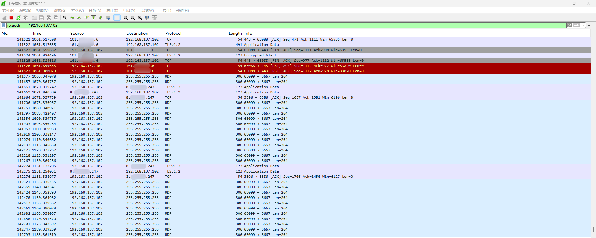
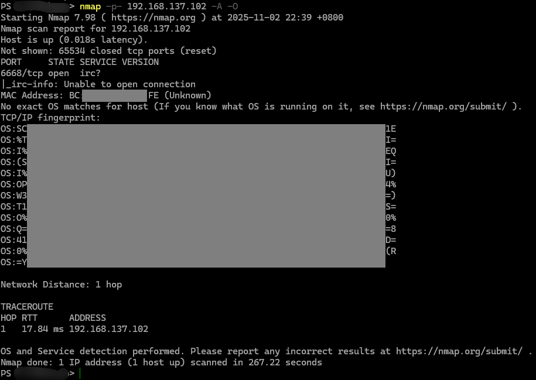

### 更新日志

- `20251101`：更新到动调抓包
- `20251102`：


### 资源解包

直接使用 MT 解包就能看到几乎所有资源文件，没有任何难度

### 代码逆向

使用 Jadx 反编译后发现，只有少得可怜的几行代码


经过研究，Vedal 用的应该是 React Native 开发的 app，其主要代码逻辑是被编译于 `./assets/index.android.bundle` 文件的 JavaScript

以前没接触过这方面的技术栈，走一步看一步

打开该文件，版本号是 0x60 即 96，是较新的版本，原始 js 应该已经被编译和一些混淆处理了


可以使用 [bongtrop/hbctool](https://github.com/bongtrop/hbctool) 工具对 `index.android.bundle` 进行解析，但是该工具已经不支持 96 版本，找到了支持 96 版本的工具 [izadgot/hbctool](https://github.com/izadgot/hbctool) 可以解析出字节码，另外一个工具 [P1sec/hermes-dec](https://github.com/P1sec/hermes-dec) 可以一定程度上反编译为 js

看一下反编译后的 JavaScript


呃呃，虽然可读性依然几乎不可读，但是至少聊胜于无吧（？

这条路估计走不通了，但是可以为后面动态调试做点准备

### 动调抓包

龟龟没做 x86 适配，可恶，模拟器用不了了（除非 ARM Windows + ARM MuMu）

HttpCanary 无效，抓不到

手边的真机没太搞明白 root，使用 `MitmProxy`抓包只能抓到一部分的 https，Swarm Sync 恰好抓不到：


不过至少知道了可能是国内的 IoT 平台——[涂鸦智能](https://www.tuya.com/cn/)

好在最后找到了 r0ysue 师傅超强的通杀脚本 [r0ysue/r0capture](https://github.com/r0ysue/r0capture)，需要配置低版本 frida 的环境，如 `15.2.2`，然后执行

```bash
python .\r0capture.py -U "Swarm Sync" -p test.pcap
```

抓包示例：


非常难懂，感觉还是会有很大难度

具体明天到货再研究研究

*~~不过明天好像有 N1CTF 来着（？~~*

### 局域网抓包

连接电脑热点，发现熔岩灯设备


抓包



如图，正常情况下，有如下几种通信：

1. 每 $5$ 秒，LavaLamp 向局域网 `255.255.255.255` 广播信息
2. 每 $60$ 秒，LavaLamp 向远程服务器 `8.***.***.247` TLS 通信一次（推测为 涂鸦智能 IOT 平台）

扫一下 LavaLamp，有且只有一个 TCP 端口开放



搜索一下，发现一个工具 [jasonacox/tinytuya](https://github.com/jasonacox/tinytuya)

